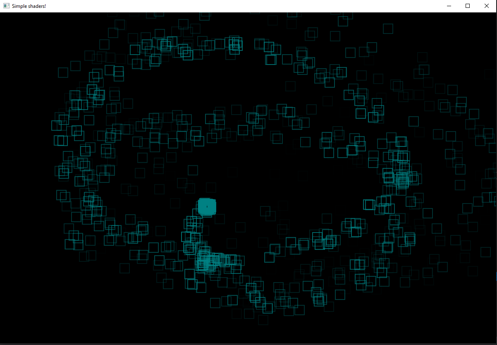
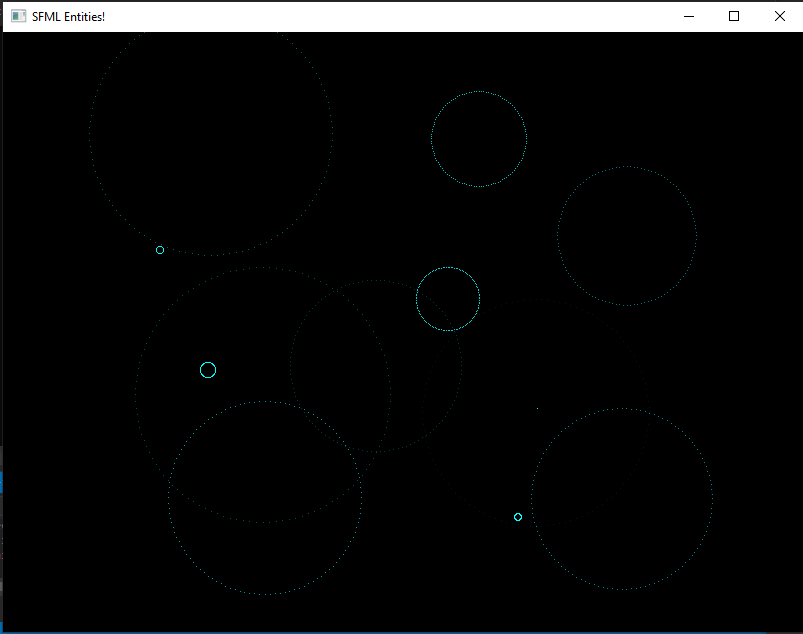

# SFML_Entities
Экспериментальный проект по созданию различных вспомогательных сущностей в библиотеке SFML - тайловые карты, системы частиц, анимаций...

Классы:
1. Sprite   - имитирует упрощённый функционал класса sf::RectangleShape без применения матрицы трансформации(за исключением вращения).
2. Animator - легковесный класс для воспроизведения линейной анимации.
3. ParticleSystem - система частиц, имитирующая шлейф из спрайтов, использует простейшие шейдеры.
4. TileMap  - компактный загрузчик, позволяющий парсить и отрисовывать многослойные тайловые карты больших размеров. 
   Для работы необходимы файлы карт, созданные в редакторе TiledMapEditor, хранящие идентификаторы тайлов в формате CSV.
   Для парсинга используется библиотека tinyxml2.
5. create_image() - функция создаёт комбинированное изображение из нескольких текстур. Требования аналогичны TileMap.
6. Triangle - класс демонстрирует вращение графического примитива GL_TRIANGLES без применения матрицы трансформации. Для расчёта 
   точек на окружности используется контейнер с заранее рассчитанными полярными координатами.
7. Splash - легковесная анимация кругов на воде с использованием примитивов GL_POINTS
8. get_texture(..) и get_font(...) - компактные, безопасные и быстрые функции доступа к ресурсам. Загружают текстуры
   и шрифты "по требованию", избегая накладных расходов при старте приложения
9. AnimationManager - класс загружает, хранит и предоставляет доступ к последовательностям кадров для быстрого создания
   линейной анимации в любой точке приложения.
   
Дополнение в процессе.

